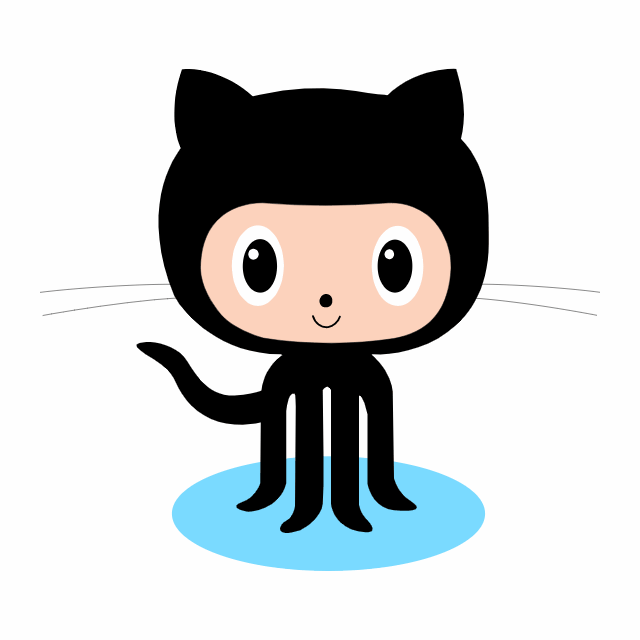

<!-- ## Hi there 👋 -->


<div align="center">
  <a href="https://git.io/typing-svg"></a>

  <br/>

  

  <br/>

</div>


#  Hi there, Good Day

##  About me
I am [Hung](https://github.com/ngsinhhung), a backend developer with a passion for technology with experience developing applications using Java (Spring Boot), Golang, Python and ReactJS. I am very keen to learn new technologies and use them to either create something useful or improve the existing software. Currently, I am focusing on honing my skills in system design and microservices architecture. I am always ready to learn new technologies and collaborate on interesting projects!

📫 Let's commit on my `gitHub`
```text
🌞 Morning     2236  commits     █░░░░░░░░░░░░░░░░░░░░░░░░   04.33 %
🌆 Daytime     25096 commits     ████████████░░░░░░░░░░░░░   50.64 %
🌃 Evening     11429 commits     ██████░░░░░░░░░░░░░░░░░░░   24.15 %
🌙 Night       12836 commits     ██████░░░░░░░░░░░░░░░░░░░   25.88 % 
```    

#  Languages and Tools:
       
 
            


#  Connect with me 

<p>
&nbsp;&nbsp;&nbsp;&nbsp;
<a style="margin-right:20px" href="https://www.linkedin.com/in/hung-sinh-nguyen/">
  
</a> &nbsp;&nbsp;&nbsp;&nbsp;
<a style="margin-right:20px" href="mailto:sinhhung.ng@gmail.com">
  
</a> &nbsp;&nbsp;&nbsp;&nbsp;
<!-- <a style="margin-right:20px" href="#">
   -->
</a> &nbsp;&nbsp;&nbsp;&nbsp;
<a style="margin-right:20px" href="https://github.com/ngsinhhung">
  
</a> &nbsp;&nbsp;&nbsp;&nbsp;
<a style="margin-right:20px" href="#">
  
</a> &nbsp;&nbsp;&nbsp;&nbsp;
<a style="margin-right:20px" href="#">
  
</a> &nbsp;&nbsp;&nbsp;&nbsp;
<a style="margin-right:20px" href="https://drive.google.com/file/d/1_whmT8szRebHZ4JdmxDUiO6e8Nmadh44/view?usp=sharing">
  
</a> &nbsp;&nbsp;&nbsp;&nbsp;
</p>

<br>


#  Spotify Playing
[]()

<b>✨✨✨✨✨✨✨✨✨✨✨✨✨Thank You 🙏🏼✨✨✨✨✨✨✨✨✨✨✨✨✨</b> 
<br><br>
 


<!-- More Information Details Myself -->
<!-- <details>
<summary>  More information about me 👋
   🐳
</summary> 


</details> -->


